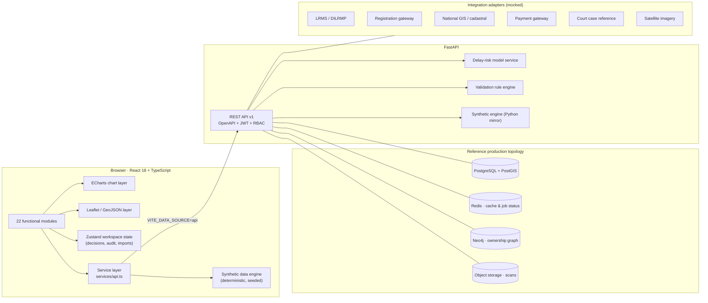

# BhoomiLens

**National Land Governance Intelligence Platform**

An AI-powered land intelligence, validation, acquisition-monitoring, GIS and decision-support
platform for transparent, evidence-driven land governance.

> **Demonstration environment using synthetic data.** Every record in this repository is produced
> by a deterministic synthetic data engine. Predictive outputs are labelled *"Simulated prediction
> for prototype demonstration. Not a legal determination."* Anomaly detections are always described
> as **potential anomalies**, never as confirmed fraud.

---

## 1. What this is

BhoomiLens is a connected, data-driven application — not a static dashboard. It tells one story
end to end:

> Upload fragmented land records and field evidence, automatically structure and validate them,
> place them on an interactive map, connect them to land acquisition projects, predict possible
> delays and conflicts, and give administrators clear, explainable interventions before risks
> become critical.

Every screen shares the same identifiers, so the demonstration never breaks:

| Entity | Reference record |
| --- | --- |
| Project | `PRJ-0001` — NH-48 Expansion Package 3, Jaipur, Rajasthan |
| Parcel | `BL-184` — Survey 184/2A, Khata KH-441, Ram Lal Meena, 2.48 ha recorded vs 2.09 ha GIS |
| Document | `DOC-000001` — Mutation Register (Hindi, handwritten, 4 pages) |
| Mutation | `MUT-441` — reused across two khasra numbers (potential anomaly) |

### Documentation

| Document | Covers |
| --- | --- |
| [`docs/IDEOLOGY.md`](docs/IDEOLOGY.md) | **Why the product is shaped this way** — the problem, the ten principles, and what it refuses to do |
| [`docs/API.md`](docs/API.md) | Endpoint reference, conventions, worked examples |
| [`docs/DEMO_SCRIPT.md`](docs/DEMO_SCRIPT.md) | Twenty-four step walkthrough of the connected story |
| This file | Architecture, modules, data model, deployment |

---

## 2. Quick start

### Frontend only (no backend required)

```bash
npm install
npm run dev            # http://localhost:5173
```

Choose any of the 14 roles on the sign-in screen. The role can be switched at any time from the
header without signing out.

### Full stack with Docker

```bash
cp .env.example .env
docker compose up --build web api
# UI  → http://localhost:5173
# API → http://localhost:8000/docs
```

### Backend only

```bash
cd backend
python -m venv .venv && .venv\Scripts\activate     # Windows
pip install -r requirements.txt
uvicorn app.main:app --reload --port 8000
```

Point the frontend at the API by setting `VITE_DATA_SOURCE=api` in `.env`. If the API is
unavailable the frontend silently falls back to the in-browser engine, so the demo never breaks.

### Commands

| Command | Purpose |
| --- | --- |
| `npm run dev` | Vite dev server |
| `npm run build` | Type-check and produce a production bundle |
| `npm run preview` | Serve the production bundle |
| `npm test` | Run the frontend test suite (55 tests) |
| `npx vite-node scripts/generate-smoke.ts standard` | Profile the synthetic engine from the CLI |
| `cd backend && pytest` | Run the API test suite |

---

## 3. System architecture



**Key design decision.** The UI never talks to a data source directly. `services/api.ts` is the
single seam: in `mock` mode it reads the in-browser engine, in `api` mode it calls FastAPI and
falls back to the engine on failure. Because of this, supplying real mock data (or a real backend)
requires **zero UI changes**.

---

## 4. Major modules

| # | Module | Route | What it does |
| --- | --- | --- | --- |
| 1 | Overview | `/overview` | National command centre: 18 KPIs, 10 interactive charts, priority intervention queue |
| 2 | Acquisition Monitor | `/acquisition` | 11-stage lifecycle: Kanban, stage workload, Gantt with critical path, timeline, comparisons |
| 3 | Projects | `/projects` | Filterable register with totals and exports |
| 4 | Project detail | `/projects/:code` | 13 tabs from summary to audit history |
| 5 | Risk Intelligence | `/risk` | Explainable score, stage probabilities, waterfall, model card, what-if simulator |
| 6 | Scenario Simulator | `/scenario` | National capacity levers → portfolio-wide risk shift |
| 7 | Digitization Studio | `/digitization` | Intake, 15-step pipeline, funnel, language mix, register |
| 8 | Document workspace | `/digitization/:code` | Three-column reviewer workspace with OCR overlay |
| 9 | Validation Workspace | `/validation` | 12 validation categories, source comparison, reviewer decisions |
| 10 | Land Digital Twins | `/twins` · `/twins/:id` | Parcel profiles, trust/health scores, timelines, evidence, graph |
| 11 | Ownership Graph | `/ownership-graph` | Interactive knowledge graph with 14 node kinds and 11 relationships |
| 12 | Time Machine | `/time-machine` | 2018-2026 reconstruction of records, delivery and environment |
| 13 | Fraud Intelligence | `/fraud` | 15 anomaly categories, trend, heat map, network, investigation |
| 14 | GIS Explorer | `/gis` | 16 map layers, draw, measure, search, import/export GeoJSON |
| 15 | Watershed Insights | `/watershed` | NDVI, moisture, land use, structures, erosion, evidence cards |
| 16 | Compensation & R&R | `/compensation` | Assessment, verification funnel, failures, grievances, entitlements |
| 17 | Review Queue | `/review` | Priority scoring, SLA, workload, bulk assignment, saved views |
| 18 | Research Hub | `/research` | Evidence library plus a grounded research assistant |
| 19 | Citizen Services | `/citizen` | Public search, status tracking, grievances, acknowledgements |
| 20 | Reports | `/reports` | 14 reports with CSV / Excel / JSON / print-PDF and scheduling |
| 21 | Data Integrations | `/integrations` | Adapter health, latency, error logs, retry |
| 22 | Governance | `/governance` | RBAC matrix, control register, model card, retention |
| 23 | Audit Logs | `/audit` | Append-only trail of every decision and access |
| 24 | Settings | `/settings` | Data scale, seed, regeneration and the mock-data importer |

Plus **LandGPT**, the permission-aware governance copilot, available from the header on every page.

---

## 5. Roles and permissions

Fourteen roles, thirty-two named permissions. Access is enforced at three levels: route guards,
action visibility and copilot answers.

| Role | Scope | Landing module |
| --- | --- | --- |
| National Administrator | national | Overview |
| State Administrator | state | Overview |
| District Collector | district | Overview |
| Land Acquisition Officer | project | Acquisition Monitor |
| Revenue Officer | district | Digitization Studio |
| Document Verification Officer | district | Digitization Studio |
| GIS Analyst | state | GIS Explorer |
| Legal Reviewer | state | Ownership Graph |
| Compensation Officer | district | Compensation & R&R |
| R&R Officer | district | Compensation & R&R |
| Auditor | national (read-only) | Audit Logs |
| Researcher | national (aggregate) | Research Hub |
| Field Officer | district | GIS Explorer |
| Citizen | public | Citizen Services |

Permission definitions live in [`src/auth/roles.ts`](src/auth/roles.ts) and are mirrored in
[`backend/app/security/rbac.py`](backend/app/security/rbac.py).

---

## 6. Database design

The reference schema is [`backend/sql/schema.sql`](backend/sql/schema.sql) (PostgreSQL 16 +
PostGIS 3.4). Highlights:

- **UUID primary keys** everywhere, with human-readable business codes (`PRJ-0001`, `BL-184`).
- **`createdAt` / `updatedAt` / `createdBy` / `version`** on mutable entities.
- **Spatial indexes** (GIST) on parcels, watersheds and geo-evidence.
- **Trigram index** on survey numbers for fast fuzzy record search.
- **Check constraints** enforce domain invariants: acquired area ≤ proposed area, compensation
  paid ≤ compensation assessed, mutation years monotonic.
- **`audit_events` is append-only** — a trigger rejects `UPDATE` and `DELETE`.
- **Privacy by schema**: owners store an `identity_hash`, beneficiaries store a
  `bank_account_token` plus `bank_account_last4`. Full identifiers never reach the database.
- **Idempotent ingestion**: `documents.source_key` is unique, so replays cannot duplicate records.
- **Analytics views**: `v_district_metrics`, `v_gis_discrepancies` (area deviation > 8%) and
  `v_parcel_overlaps` (true PostGIS intersection) back the GIS conflict signals.

Entity coverage: User, Role, Permission, State, District, Tehsil, Village, Project, ProjectStage,
ProjectMilestone, Parcel, Owner, OwnershipRecord, Mutation, Registration, DocumentRecord,
DocumentPage, ExtractedField, ValidationIssue, FraudAlert, RiskPrediction, Intervention,
CompensationRecord, Beneficiary, RRRecord, LegalCase, FieldInspection, GeoEvidence, Watershed,
ResearchDocument, ReviewTask, Notification, AuditEvent, IntegrationStatus.

---

## 7. API design

Interactive documentation is served at `/docs` (Swagger UI) and `/redoc`; the machine-readable
contract is at `/openapi.json`. See [`docs/API.md`](docs/API.md) for the full reference.

Conventions applied to every endpoint:

- Versioned prefix `/api/v1`
- Bearer-token authentication, permission-guarded per route
- `page`, `page_size`, `search`, `sort_by`, `sort_dir`, `state`, `district` on all list endpoints
- Structured errors: `{ "code": "...", "message": "...", ... }`
- `X-Correlation-Id` and `X-Response-Time-Ms` on every response

```bash
TOKEN=$(curl -sX POST "http://localhost:8000/api/v1/auth/token?role=national_admin" | jq -r .access_token)
curl -H "Authorization: Bearer $TOKEN" "http://localhost:8000/api/v1/projects?search=NH-48"
curl -H "Authorization: Bearer $TOKEN" "http://localhost:8000/api/v1/parcels/BL-184"
curl -H "Authorization: Bearer $TOKEN" "http://localhost:8000/api/v1/projects/PRJ-0001/risk"
```

---

## 8. Frontend folder structure

```
src/
├── App.tsx                      # Route table with lazy loading and permission guards
├── main.tsx                     # Bootstrap, QueryClient, error boundary
├── index.css                    # Design tokens and component classes
├── auth/
│   ├── roles.ts                 # 14 roles, 32 permissions, data-scope guard
│   └── PermissionGuard.tsx      # <Can> and <PermissionGuard>
├── components/
│   ├── charts/                  # EChart wrapper, ChartCard, 15 option builders
│   ├── copilot/LandGptPanel.tsx
│   ├── dashboard/PriorityInterventionQueue.tsx
│   ├── kpi/KpiCard.tsx
│   ├── layout/                  # AppShell, Header, Sidebar, PageHeader
│   ├── map/MapView.tsx          # Imperative Leaflet wrapper
│   ├── risk/RiskPanel.tsx       # Score header, waterfall, model card, simulator
│   └── ui/                      # Card, Badge, DataTable, Tabs, Modal, Form, …
├── config/                      # appConfig, constants, navigation
├── copilot/engine.ts            # Grounded, permission-aware answer engine
├── data/
│   ├── catalog.ts               # States, districts, names, native-script samples
│   ├── dataset.ts               # Assembles and caches the dataset
│   ├── importer.ts              # Zod-validated mock-data import contracts
│   └── generators/              # geography, people, projects, parcels, documents, …
├── graph/ownershipGraph.ts      # Ego-network builder
├── hooks/                       # useScope, useAsync
├── lib/                         # rng, format, geo, export, stats, cn
├── pages/                       # One file per module (24 pages)
├── risk/model.ts                # Transparent weighted-factor delay model
├── services/                    # analytics selectors, api facade, http client
├── store/appStore.ts            # Session, filters, workspace state, audit trail
├── test/                        # 55 tests
├── types/index.ts               # Complete domain model
└── validation/engine.ts         # Deterministic rule engine
```

## 9. Backend folder structure

```
backend/
├── app/
│   ├── main.py         # App factory, CORS, correlation IDs, error handler
│   ├── api.py          # 17 routers covering every module
│   ├── config.py       # Environment-driven settings
│   ├── pagination.py   # Shared pagination / filtering / sorting
│   ├── synthetic.py    # Deterministic engine + risk model (Python mirror)
│   └── security/       # JWT auth, RBAC, permission dependencies
├── sql/schema.sql      # PostgreSQL + PostGIS reference schema
├── tests/test_api.py   # API contract tests
├── Dockerfile
└── requirements.txt
```

---

## 10. Deployment

The frontend runs entirely client-side in `mock` mode, so it deploys as a static site with no
backend and no hosting cost.

### GitHub Pages (configured)

[`.github/workflows/deploy.yml`](.github/workflows/deploy.yml) builds and publishes on every push
to `main`.

1. Push the repository to GitHub.
2. **Settings → Pages → Build and deployment → Source: GitHub Actions**.
3. The site goes live at `https://<user>.github.io/<repo>/`.

The workflow injects `VITE_BASE_PATH=/<repo>/` so assets resolve under the project subpath, and
`scripts/postbuild.mjs` writes `404.html` and `.nojekyll` so deep links such as
`/projects/PRJ-0001` survive a hard refresh.

### Netlify or Vercel

Both are pre-configured ([`netlify.toml`](netlify.toml), [`vercel.json`](vercel.json)) — import the
repository and accept the detected settings. No base path is needed because both serve from the
domain root.

### Self-hosted containers

```bash
docker compose up --build web api
```

`Dockerfile` builds the SPA and serves it through nginx with SPA routing, gzip and security
headers; `backend/Dockerfile` runs the API as a non-root user with a health check.

### Build-time configuration

| Variable | Default | Purpose |
| --- | --- | --- |
| `VITE_BASE_PATH` | `/` | Public path; set to `/<repo>/` for GitHub Pages project sites |
| `VITE_DATA_SOURCE` | `mock` | `mock` (in-browser engine) or `api` (FastAPI backend) |
| `VITE_API_BASE_URL` | `http://localhost:8000/api/v1` | Backend URL when `VITE_DATA_SOURCE=api` |
| `VITE_DATA_SCALE` | `standard` | `demo`, `standard` or `national` |
| `VITE_DATA_SEED` | `20260909` | Seed for the deterministic generator |

> Deploy the frontend in `mock` mode for public demos. Pointing a public site at a backend would
> expose the API without a gateway, rate limiting or a real identity provider.

---

## 11. Mock-data contracts

Everything the UI renders comes from the centralised data layer. No component embeds a data array.
Supply your own data through **Settings → Mock-data import** (JSON, CSV, GeoJSON) or by dropping a
data pack with these files:

| File | Collection | Required columns |
| --- | --- | --- |
| `projects.json` | Projects | `id`, `code`, `name`, `state`, `district`, `projectType` |
| `projectStages.json` | Project stages | `projectId`, `stage` |
| `documents.json` | Documents | `code`, `documentType` |
| `extractedFields.json` | Extracted fields | `documentId`, `field` |
| `parcels.geojson` | Parcels | `parcelId`, `surveyNumber`, `owner`, `area` |
| `ownershipRecords.json` | Ownership chain | `parcelId`, `ownerName`, `fromYear` |
| `validations.json` | Validation issues | `category`, `severity` |
| `fraudAlerts.json` | Potential anomalies | `code`, `category` |
| `compensation.json` | Compensation | `beneficiaryId`, `amountAssessed`, `amountPaid`, `status` |
| `watershed.json` | Watersheds | `code`, `name` |
| `reviewQueue.json` | Review tasks | `code`, `reason` |
| `monthlyMetrics.json` | Monthly series | `period`, `documentsUploaded`, `documentsProcessed` |
| `districtMetrics.json` | District scorecards | `district`, `state`, `digitizationProgress` |
| `auditLogs.json` | Audit trail | `actor`, `action` |

The importer validates every row against a Zod schema, reports per-row errors, supports column
mapping, and only then replaces the collection.

### Generation volumes

| Scale | Projects | Parcels | Documents | Beneficiaries | Review items |
| --- | --- | --- | --- | --- | --- |
| `demo` | 400 | 4,000 | 2,500 | 3,000 | 1,200 |
| `standard` (default) | 1,500 | 12,000 | 8,000 | 9,000 | 3,500 |
| `national` | 1,500 | 100,000 | 50,000 | 50,000 | 20,000 |

Set the scale with `VITE_DATA_SCALE` or from the Settings module. The `national` profile matches
the full specification volume and needs roughly 8 GB of RAM in `mock` mode.

---

## 12. Dashboard chart definitions

Every chart is interactive: hover tooltips, legends, responsive resizing, drill-down where
meaningful, PNG export, CSV export of the underlying data, loading skeletons and no-data states.
All of them respond to the header filters.

| Chart | Type | Source selector |
| --- | --- | --- |
| Document throughput | Multi-series line | `documentPipelineSeries` |
| Acquisition progress by state | Stacked bar | `acquisitionByState` |
| Major delay drivers | Horizontal bar | `delayDriverSeries` |
| Project-risk distribution | Donut | `riskDistribution` |
| Processing pipeline | Funnel | `processingFunnel` |
| District performance | Heat map (4 metrics) | `districtHeatMap` |
| Compensation assessed vs disbursed | Area | `compensationOverTime` |
| Completion vs delay probability | Bubble scatter | `completionVsDelayScatter` |
| Programme health | 4 gauges | `gaugeMetrics` |
| District ranking | Ranking bar (5 metrics) | `districtRanking` |
| Risk contributors | Waterfall | `RiskPrediction.contributors` |
| Stage-wise delay probability | Horizontal bar | `RiskPrediction.stageProbabilities` |
| Lifecycle schedule | Custom Gantt with critical path | `ProjectStage[]` |
| Ownership network | Force-directed graph | `buildParcelGraph` |
| KPI trends | 18 sparklines | `NationalKpi.sparkline` |

---

## 13. GIS approach

- All geometry is **GeoJSON** in EPSG:4326; parcels are polygons, evidence and markers are points.
- Cadastral polygons are generated per parcel with a deliberate ~14% population of area
  discrepancies so that GIS reconciliation is demonstrable.
- Area is computed with a shoelace formula on an equirectangular projection
  (`ringAreaHectares`), which matches the PostGIS `ST_Area(geom::geography)` view in production.
- Rendering is capped at 1,200 parcels per view for interactivity; the cap is explicit in the UI.
- Sixteen layers grouped as administrative, cadastral, acquisition, environment and evidence.
- Tools: layer control, search by parcel/survey/khasra/village/project, polygon draw, area and
  perimeter measurement, satellite toggle, imagery-year slider, GeoJSON import and export,
  full-screen, legend.
- Cadastral visual system: warm off-white base, fine parcel lines, deep navy administrative
  boundaries, red-orange risk markers, teal watershed layers, olive vegetation layers.

---

## 14. Security design

| Area | Implementation |
| --- | --- |
| Authentication | Prototype JWT (`/auth/token`); production uses OAuth 2.0 / OIDC |
| Authorisation | 32 named permissions enforced on routes, actions and copilot answers |
| Data scope | `inScope()` restricts state/district roles to their own records |
| Masking | Bank accounts, identity numbers and public owner names are masked by default |
| Transport | TLS terminated at ingress; security headers set in `nginx.conf` |
| At rest | Database and object-storage encryption via platform KMS |
| Auditability | Actor, role, action, record, old value, new value, reason, timestamp, source IP, correlation ID |
| Immutability | `audit_events` rejects `UPDATE`/`DELETE` at the database level |
| Model governance | Every prediction stores model version, inputs, confidence and completeness |
| Injection | No string-concatenated SQL; parameterised access only |
| Container | Backend runs as a non-root user with a health check |

**Explicit non-claims.** No live government API is contacted. No legal conclusion is produced. No
record here is authoritative.

---

## 15. Phased implementation plan

| Phase | Scope | Status |
| --- | --- | --- |
| 1 | Design system, domain model, RBAC, synthetic engine, service layer | Complete |
| 2 | Overview, Acquisition, Projects, Project detail, Risk, Scenario Simulator | Complete |
| 3 | Digitization Studio, document workspace, Validation Workspace | Complete |
| 4 | Land Digital Twins, Ownership Graph, Time Machine, Fraud Intelligence | Complete |
| 5 | GIS Explorer, Watershed, Compensation & R&R, Review Queue | Complete |
| 6 | Research Hub, Citizen Services, Reports, Integrations, Governance, Audit, Settings | Complete |
| 7 | FastAPI backend, OpenAPI, JWT/RBAC, PostGIS schema, Docker, CI, tests | Complete |
| 8 | Real OCR service, PostGIS persistence, Neo4j graph, Celery workers, live adapters | Future scope |

---

## 16. Testing

```bash
npm test                 # 55 frontend tests
cd backend && pytest     # API contract tests
```

Frontend coverage: deterministic RNG, risk model calibration and monotonicity, validation rule
engine (all seven rules plus determinism), dataset invariants (flagship records, reproducibility,
polygon validity, compensation never exceeding assessment, masking), RBAC matrix, copilot grounding
and permission denial, analytics selectors and pagination.

Backend coverage: health and OpenAPI publication, token issuance, authentication requirement,
per-role permission enforcement, pagination and search, flagship project and parcel fidelity,
risk disclaimer presence, simulation monotonicity, funnel monotonicity, anomaly labelling, GeoJSON
ring closure, compensation invariants and scope filtering.

---

## 17. Accessibility and non-functional design

- Keyboard-reachable controls, visible focus rings, `aria-label` on every icon-only control,
  `aria-sort` on sortable table headers, `role="img"` with a label on every chart.
- Colour choices avoid red/green-only encoding; status is always accompanied by text.
- Desktop-first layout that reflows to tablet and mobile for field officers.
- Print stylesheet drives the PDF report path.
- Designed for multitenant state/district workspaces, asynchronous document processing,
  retry-safe and idempotent ingestion, data lineage, model versioning and low-bandwidth offices.

---

## 18. Licence and provenance

Prototype software prepared for demonstration. Not certified for statutory land administration.
All names, records, coordinates and figures are synthetic.
